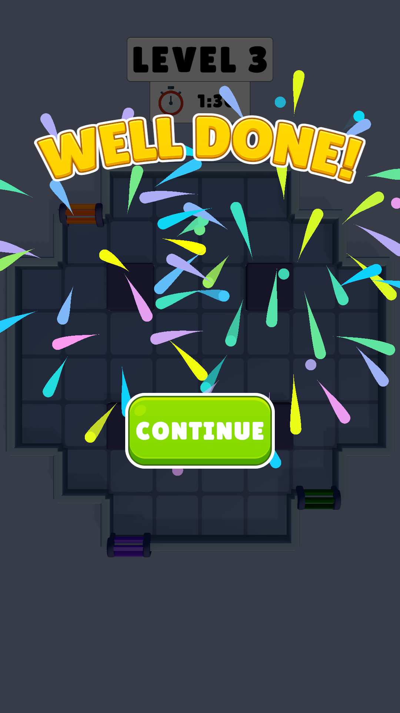
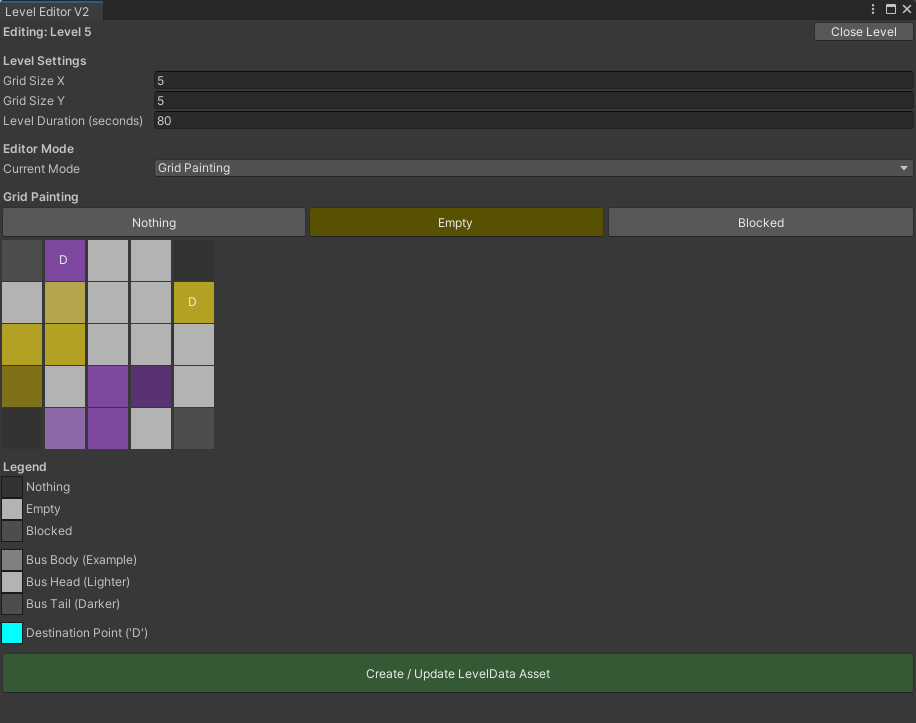

# Bus Grid Puzzle

A grid-based puzzle game where players maneuver snake-like buses to their designated destinations to pick up passengers. The project features a robust, custom-built Level Editor for creating and managing all aspects of a level.

## Table of Contents
1.  [Core Gameplay Mechanics](#core-gameplay-mechanics)
2.  [Project Structure](#project-structure)
3.  [The Level Editor](#the-level-editor)
4.  [How to Create a New Level (Tutorial)](#how-to-create-a-new-level-tutorial)
5.  [Key Systems Deep Dive](#key-systems-deep-dive)
6.  [Personal Notes](#personal-notes)

## Core Gameplay Mechanics

The gameplay revolves around solving spatial puzzles on a grid.

* **Bus Movement**: Players can click and drag buses to move them one cell at a time. Buses behave like snakes; each segment follows the path of the one before it. A key mechanic is the ability to initiate movement from either the **Head** (for forward movement) or the **Tail** (for backward movement), allowing for complex maneuvers.
* **Passenger Collection**: Each level contains colored buses and corresponding colored "Destination" points (stairs). The primary objective is to move a bus to its matching destination. When a bus is correctly positioned, passengers waiting in a queue will begin to board.
* **Collision System**: The movement is constrained by a robust collision system:
    * Buses cannot move through `Blocked` cells (static obstacles).
    * Buses cannot move through other buses.
    * Buses cannot perform a U-turn and move over their own body or tail parts.

## Project Structure

The project is organized into several key namespaces and scripts, primarily located in the `Assets/GameFolder/_Scripts/` directory.

* `SKC.Grid`
    * **`GridDefinitions.cs`**: Contains core data structures like `GridPosition` and enums like `GridContentType`.
    * **`GridLevelData.cs`**: A `[Serializable]` class that defines the structure for the `_grid.json` file, holding the static layout of the level.
    * **`LevelGridGenerator.cs`**: A crucial runtime singleton. It reads the level's JSON files (`grid`, `destination`) at startup and procedurally generates the visual representation of the level, including the grid cells, borders, and destination objects.

* `SKC.Bus`
    * **`BusDefinitions.cs`**: Defines the data structures for buses, including `BusInfo`, `BusPartData`, and the `BusColor` enum.
    * **`BusController.cs`**: The "brain" of a bus. This component manages the collection of `BusPart`s and handles all movement logic, including forward/backward movement and collision checks.
    * **`BusPart.cs`**: A single segment of a bus (Head, Body, or Tail).
    * **`BusPartVisual.cs`**: Handles visual aspects (color).

* `SKC.GameLogic`
    * **`DestinationDefinitions.cs`** & **`DestinationQueue.cs`**: Manages the passenger queues at destination points.
    * **`GameManager.cs`** or **`PassengerSpawner.cs`**: The orchestrator scripts that set up the level at runtime.
    * **`GridOccupancyManager.cs`**: A vital singleton that keeps track of which cells are occupied by dynamic objects (like bus parts), enabling real-time collision detection.

* `SKC.Inputs`
    * **`PlayerInputController.cs`**: A singleton that handles all player input (clicking, dragging) and translates it into commands for the `BusController`.

* `SKC.Level`
    * **`LevelData.cs`**: A `ScriptableObject` that acts as the central asset for a complete level, holding references to all the JSON data files.

* `Editor`
    * **`LevelAndBusEditorWindow.cs`**: The powerful, all-in-one custom editor window used to design levels.

## The Level Editor

The backbone of the production pipeline is the custom Level Editor, accessible via the Unity menu (`SKC > Level Editor`). It provides a comprehensive, user-friendly interface for level creation.

### Workflow

The editor uses a **ScriptableObject-centric workflow**. Instead of managing loose JSON files, the primary asset for a level is a `LevelData.asset`. The editor handles the creation, parsing, and bundling of the necessary JSON files into this asset automatically.

### Editor Modes

The editor operates in three distinct modes to keep the UI clean and focused:
1.  **Grid Painting**: For designing the static level layout. You can paint cells as `Empty` (walkable), `Blocked` (obstacle), or `Nothing` (outside the playable area).
2.  **Bus Placement**: For adding and configuring buses. You can draw a bus's path, set its color, and delete previously placed buses.
3.  **Destination Placement**: For placing the destination points (stairs) where passengers will queue up. You can set the destination's color to link it to a specific bus.

## How to Create a New Level (Tutorial)

Follow these-adımlar to design a complete level from scratch.

1.  **Open the Editor**
    * In the Unity menu bar, go to `SKC > Level Editor`.

2.  **Start a New Level**
    * The editor will open on a welcome screen. Click the **"Create New Level"** button.

3.  **Set Level Properties**
    * The main editor view will appear. In the **"Level Settings"** section at the top, define the `Grid Size` (e.g., X: 6, Y: 8) and the `Level Duration` in seconds.

4.  **Paint the Grid Layout**
    * Ensure you are in **`GridPainting`** mode using the "Current Mode" dropdown.
    * Use the "Grid Painting" brushes (`Nothing`, `Empty`, `Blocked`) to design the static map. Paint the playable area with `Empty` and `Blocked` cells.

5.  **Place Buses**
    * Switch to **`BusPlacement`** mode.
    * Select a `New Bus Color` from the dropdown.
    * Click **"Start Placing New Bus"**. The editor is now in path-drawing mode.
    * Click on adjacent `Empty` grid cells to draw the bus's path, starting from the head.
    * When finished, click **"Finish Placing Bus"**. The bus will appear in the "Placed Buses" list.
    * You can change a placed bus's color or delete it using the "X" button in the list.
    * Repeat for all buses in the level.

6.  **Place Destinations**
    * Switch to **`DestinationPlacement`** mode.
    * Select a `Destination Color` from the dropdown. This color should match a bus you have already placed.
    * Click on an `Empty` grid cell to place a destination marker. A "D" will appear. Clicking the same cell again will remove the destination.

7.  **Save the Level**
    * This is a two-step process handled by one button. Click the green **"Create / Update LevelData Asset"** button at the bottom.
    * **Step A (JSON Folder):** A folder selection dialog will pop up. Choose a folder where the level's raw data will be stored (e.g., create and select `Assets/GameFolder/Data/Level 3/`). The editor will save `_grid.json`, `_bus.json`, and `_dest.json` files here.
    * **Step B (ScriptableObject Asset):** Immediately after, a file save dialog will appear. Name your final level asset (e.g., `Level_03.asset`) and save it in the *same folder*.
    * The editor will automatically create the `LevelData` asset and link the newly created JSON files to it.

You now have a complete, self-contained `LevelData` asset ready to be used by the game's runtime systems.

## Key Systems Deep Dive

* **Event-Driven Spawning**: The runtime setup is decentralized. `LevelGridGenerator` spawns destinations and fires a `public static event`. The `PassengerSpawner` listens for this event and, upon hearing it, spawns the correct number of passengers for that specific destination, creating a clean, decoupled architecture.
* **Occupancy Management**: The `GridOccupancyManager` singleton is the source of truth for all dynamic object positions. The collision detection logic in `BusController` queries this manager to determine if a move is valid, preventing conflicts.

## Personal Notes

This project was primarily an exercise in building a robust, data-driven level creation pipeline and complex gameplay mechanics.

- The current visuals are functional but serve as placeholders. There is significant room for artistic and graphical improvements to enhance the player experience.
- My main focus was concentrated on developing the comprehensive **Level Editor** and the core game systems (grid, bus movement, collision, passenger queuing, etc.).

For extra visual assets, gameplay videos, and design mockups, please check the [Content folder](./Contents/).
